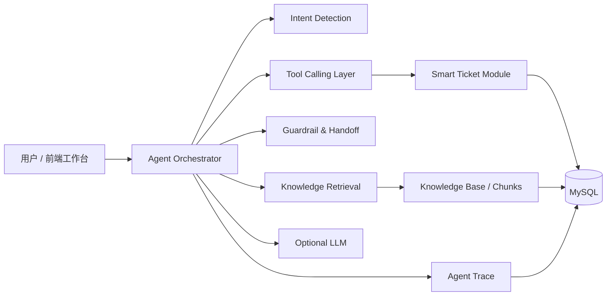

# SmartOps Agent

基于 RAG + Tool Calling 的企业工单 Agent 助手。它不是普通聊天机器人，而是一个能检索企业知识库、理解用户意图、调用工单工具、记录执行链路并在低置信场景转人工的业务型 AI Agent 项目。

## 核心能力

- RAG 知识库：支持 Markdown/TXT 类文本入库、自动切块、本地向量化、TopK 检索和相似度阈值控制。
- Tool Calling：封装 `createTicket`、`queryTicketByNo`、`replyTicket`、`queryCategories` 等工单工具。
- 多轮会话：会话、消息和上下文写入 MySQL，创建工单前保留待确认草稿。
- Agent Trace：记录 `intent_detection`、`knowledge_retrieval`、`handoff_decision`、`tool_call`、`llm_generation` 等步骤。
- 人工兜底：退款、账号安全、用户反馈未解决、知识库低置信等场景自动建议创建工单。
- 可选大模型：默认无需 API Key 也可运行；配置 OpenAI-compatible API 后可增强回答生成。
- 前端工作台：提供会话、知识库检索、工单队列、Trace 时间线和指标面板。

## 技术栈

| 模块 | 技术 |
| --- | --- |
| 后端 | Java 17, Spring Boot 3, JDBC, Flyway, MySQL |
| Agent | Rule Intent + RAG + optional OpenAI-compatible LLM |
| 数据 | MySQL 8, Redis 7, local hashed embedding |
| 前端 | React 18, TypeScript, Vite, lucide-react |
| 部署 | Docker Compose |

## 架构



## 本地启动

### 1. 启动依赖

你的本地数据库账号密码已按 `root / 123456` 配好。先创建数据库：

```sql
CREATE DATABASE IF NOT EXISTS smartops_agent DEFAULT CHARACTER SET utf8mb4 COLLATE utf8mb4_unicode_ci;
```

启动后端：

```bash
cd agent-backend
mvn spring-boot:run
```

启动前端：

```bash
cd agent-frontend
npm install
npm run dev
```

访问：

- 前端工作台：http://localhost:5173
- 后端健康检查：http://localhost:8080/api/health

### 2. Docker Compose 一键启动

```bash
cd deploy
docker compose up -d --build
```

访问 `http://localhost:5173`。

## 可选 AI 配置

默认 `AI_ENABLED=false`，系统使用本地 RAG 摘要回答，便于无 Key 演示。需要接入 OpenAI-compatible API 时设置：

```bash
AI_ENABLED=true
AI_BASE_URL=https://api.openai.com/v1
AI_API_KEY=你的Key
AI_CHAT_MODEL=gpt-4o-mini
```

## 主要接口

| 方法 | 路径 | 说明 |
| --- | --- | --- |
| POST | `/api/agent/chat` | Agent 多轮对话 |
| GET | `/api/agent/conversations` | 会话列表 |
| POST | `/api/knowledge/documents` | 上传知识文档 |
| GET | `/api/knowledge/search` | RAG 检索 |
| POST | `/api/tickets` | 创建工单 |
| GET | `/api/tickets/{ticketNo}` | 查询工单详情 |
| POST | `/api/tickets/{ticketNo}/reply` | 补充工单信息 |
| GET | `/api/traces` | Agent 执行链路列表 |
| GET | `/api/dashboard/summary` | 控制台指标 |

## 示例对话

用户：我的账号登录不上，重置密码也不行。  
Agent：这个问题建议进入人工工单处理。已为你整理好工单草稿：账号登录异常，分类 ACCOUNT_LOGIN，优先级 P2。确认创建吗？

用户：确认创建。  
Agent：工单已创建，编号 TK202607050001，当前状态为待处理，处理人是客服A。

用户：查一下 TK202607050001 的处理进度。  
Agent：工单 TK202607050001 当前状态为待处理，分类是账号登录，处理人客服A。

## 项目结构

```text
agent-backend/
  src/main/java/com/smartops/agent
    controller/      REST API
    service/         Agent, RAG, Tool, Trace, Dashboard
    config/          CORS, properties, seed data
    common/          response and exception handling
  src/main/resources/db/migration
agent-frontend/
  src/main.tsx       console application
  src/styles.css     product UI styles
deploy/
  docker-compose.yml
docs/
  api-examples.md
  demo-script.md
```

## 面试亮点

1. 业务闭环：Agent 不只回答文本，还能创建、查询、补充真实工单数据。
2. 可审计：每次回答都有 Trace 和 Step Log，能解释用了哪些知识、调用了哪些工具。
3. 安全边界：创建类操作必须用户确认，敏感操作只转人工或创建工单。
4. 可运行：无大模型 Key 时也能展示完整 RAG + Tool Calling 流程。
